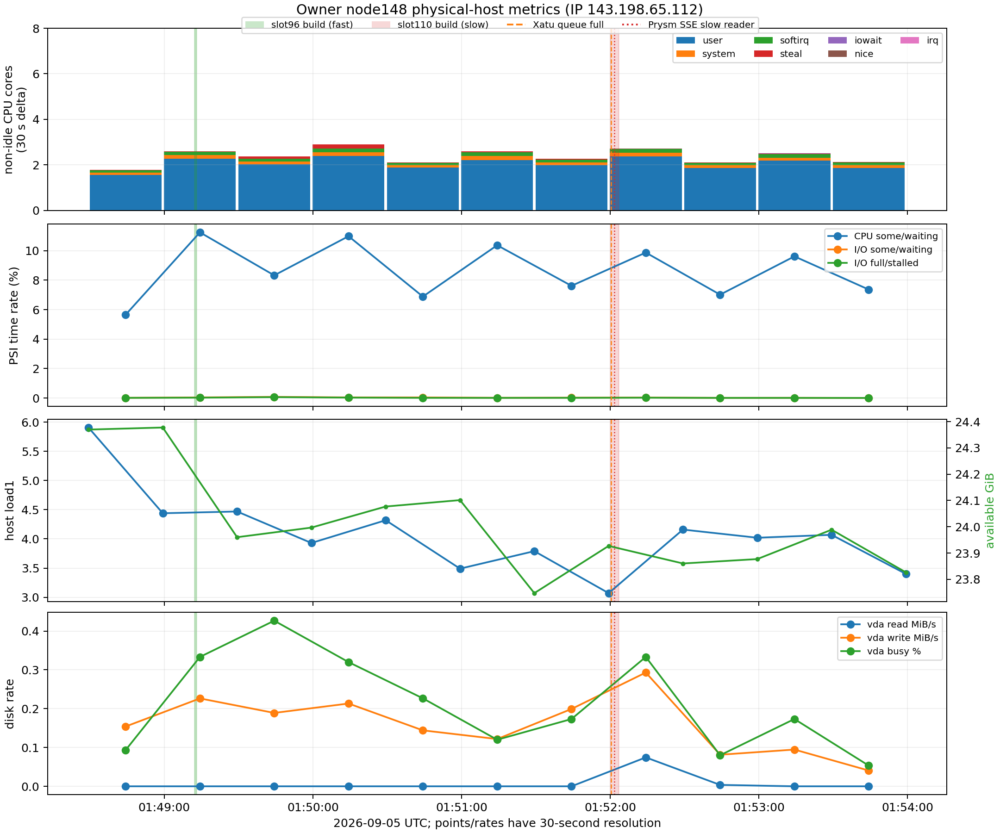

# Owner148 physical-host metrics around slots 96 and 110

## Finding

The physical host was not continuously CPU-saturated in the native 30-second
sample interval containing the slow slot-110 build. Across eight CPU series,
that interval recorded 2.712 non-idle CPU-seconds per wall second and 5.220
idle CPU-seconds per wall second: 34.19% non-idle among 7.932 observed
CPU-seconds per second. The modes that execute work (`user`, `system`, `nice`,
`irq`, and `softirq`) totaled 2.698 cores; the remaining non-idle time was
0.011 steal and 0.003 I/O-wait cores. CPU PSI `some` increased by 2.960589 seconds, or 9.87%
of the 30-second interval. This establishes intermittent runnable-task waiting,
not continuous saturation during the 3.393-second build.

The host series cannot resolve the build itself. Native scrapes are exactly
30.000 seconds apart. Slot 110's `01:52:00.016984–01:52:03.409893Z` build,
Xatu's queue-full record at `01:52:00.307Z`, and Prysm's SSE slow-reader record
at `01:52:01.725Z` all fall within the single
`01:51:59.399–01:52:29.399Z` counter interval. A short CPU or I/O burst can be
diluted by the remaining 26.6 seconds, and host-wide metrics cannot establish
whether one process or cgroup was constrained.

## Native interval comparison

| Signal | Fast slot96 interval, `01:48:59.399–01:49:29.399` | Slow slot110 interval, `01:51:59.399–01:52:29.399` |
|---|---:|---:|
| Build inside interval | `01:49:12.145581–01:49:13.014523` | `01:52:00.016984–01:52:03.409893` |
| User CPU | 2.272 cores | 2.367 cores |
| System CPU | 0.153 cores | 0.162 cores |
| Softirq CPU | 0.142 cores | 0.159 cores |
| Steal CPU | 0.024 cores | 0.011 cores |
| I/O-wait CPU | 0.001 cores | 0.003 cores |
| Total non-idle CPU | 2.594 cores, 32.69% | 2.712 cores, 34.19% |
| Idle CPU | 5.342 cores | 5.220 cores |
| CPU PSI `some`/waiting | 11.24% | 9.87% |
| I/O PSI `some` / `full` | 0.0421% / 0.0249% | 0.0320% / 0.0224% |
| Memory PSI `some` / `full` | 0 / 0 | 0 / 0 |
| Available memory, bounding scrapes | 24.378 → 23.960 GiB | 23.927 → 23.860 GiB |
| `node_load1`, bounding scrapes | 4.44 → 4.47 | 3.07 → 4.16 |
| Host OOM kills | no change, cumulative value 0 | no change, cumulative value 0 |
| Major page faults | no increase | 1 in 30 s |
| `vda` read / write | 0 / 0.226 MiB/s | 0.0745 / 0.293 MiB/s |
| `vda` I/O busy time | 0.333% | 0.333% |

The slot-110 interval does not show elevated whole-host CPU PSI relative to the
fast slot-96 interval. It also has zero memory pressure time and low disk busy
time at this resolution. These comparisons do not rule out contention inside
the build window, process-local scheduling, a per-process or cgroup limit, or
latency unrelated to physical-host resource pressure.

## Identity and scope

The selector uses owner node148's public IP `143.198.65.112` and the
node-exporter `job="node"`. Prometheus attaches stale metadata labels
`instance="glamsterdam-devnet-9-lighthouse-reth-6"`,
`consensus_client="lighthouse"`, and `execution_client="reth"`. Those labels
must not be read as the process identity. The data describe the physical host;
separate retained evidence identifies owner148's Prysm process.

Raw Prometheus outputs preserve every native timestamp:

* [`node-cpu-native-0148-0154.json`](node-cpu-native-0148-0154.json)
* [`node-pressure-memory-native-0148-0154.json`](node-pressure-memory-native-0148-0154.json)
* [`node-disk-native-0148-0154.json`](node-disk-native-0148-0154.json)

[`host-owner148-derived.json`](host-owner148-derived.json) contains every
per-scrape rate, [`analyze_host_metrics.py`](analyze_host_metrics.py) derives
the results, and [`queries.md`](queries.md) records the exact PromQL. The plot
uses one bar or point per native scrape interval; it does not smooth to
one-second resolution:

