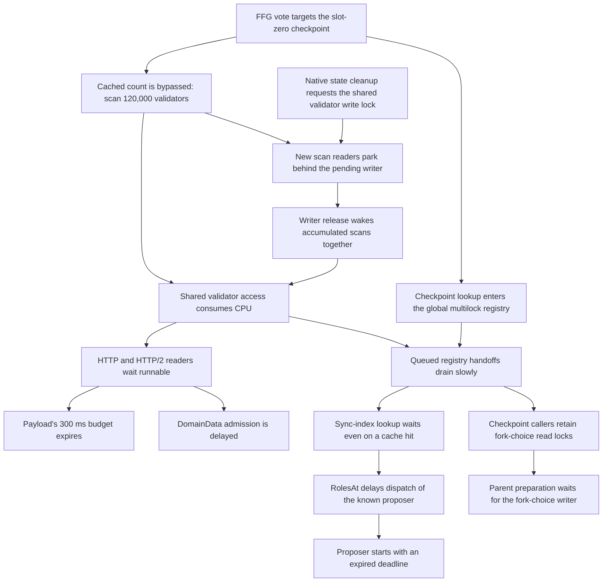

# Best-supported causal explanation of the first proposal opportunities

The established workload defect is **repeated counting of the unchanged
genesis validator registry**. The deployed `ActiveValidatorCount` declines
its cached result for a slot-zero checkpoint, so each qualifying gossip vote
scans all 120,000 validators again. In the full-process controls, removing
only these repeated counts allows all three previously failing proposals to
complete. The counts consume CPU and delay shared queues and network
servicing; proposal code lets those dependencies consume the slot budget
and lets some canceled work continue.

The historical logs establish execution of this count path and identify each
proposal's failed dependency. Separate traces and bounded reproductions
locate the ways count pressure reaches those dependencies. The precise path
differs by slot; the controls do not support assigning every RPC the same wait.

This report connects the historical outcomes to source and measured controls.
It distinguishes a reproduced mechanism from a recovered historical stack,
and keeps the null controls alongside the positive results. The
[complete outcome table](explanation.md) remains the
index of original owner logs. Slots 1–14 failed; slots 15 and 16 produced and
were imported by all 1,000 nodes. Slot 0 is genesis.

| Slots | Best-supported cause of the observed outcome | Attribution strength |
| --- | --- | --- |
| 0 | Genesis; ordinary proposal is explicitly skipped. | Direct code/outcome fact. |
| 1 | Genesis-count overload delays BN servicing and proposal prerequisites; the cold RANDAO-domain lookup fails before a block request can be made. | Ordinary DomainData reader starvation is traced; a bounded real-gossip control also reproduces 4.781 seconds before server admission. Node 169's own request-admission time remains unlogged. |
| 2, 3, 7, 11, 12 | The same repeated genesis counts amplify checkpoint/global-registry queues; serial sync preflight consumes the budget and the proposer is dispatched expired. | Earlier causal finding retained and strengthened by the real-work queue reproduction; individual historical entry times are unlogged. |
| 4 | Late sync preflight leaves too little time for selection-domain access; RANDAO is then dispatched expired. | Expired dispatch exact; earlier budget split is a ranked inference. |
| 5, 6, 8, 9 | Successful payload response fails to complete through the BN's short HTTP RPC budget; error translation suppresses intended recovery, and no matching P2P bid is available. | Strong cross-method historical support and real HTTP/recovery reproductions; exact historical transport return site unlogged. |
| 10, 14 | Raw attestation snapshot cost plus startup interference; canceled work continues despite newer pool/node progress. | Moderate historical attribution, with real raw/compact and concurrent-snapshot controls. |
| 13 | Parent preparation waits for fork-choice access behind checkpoint readers, then slot processing observes cancellation. | Real dependency/lock mechanism reproduced; historical phase split unlogged. |
| 15, 16 | Fresh proposals complete on owners with sufficient budget and improved local conditions. | Production/import exact; local recovery cause inferred. Later head changes have a separate vote-cohort explanation. |

The experimentally located paths are:

The diagram combines separate source paths and controlled measurements; it is
not a recovered trace of a single historical node. Payload recovery and raw
attestation packing have additional defects described below.

## What the previous investigation already established

The shared cause for slots 1–3 was not an unexplained deadline. Earlier work
identified and experimentally isolated **repeated whole-registry counting on
the genesis checkpoint**, and that finding carries forward here. The new
controls explain additional ways it interferes with a proposal; their finer
historical timing qualifications do not erase the earlier causal result.

- jj `0f1ddfdd` (`lqxvxsvy`) added
  [Genesis FFG validation amplification: slots 1–3](../genesis_ffg_root_cause.md).
  Three valid attestations against a warm slot-0 checkpoint performed 360,000
  measured validator visits; the corresponding advanced-state control
  performed none. The corrected production validation benchmark was about
  35 times slower on the real startup state.
- jj `a8d960ad` (`kkwpmvyz`) recorded the
  [E1/F1 full-process comparison](../startup3/early-gossip-results.md).
  E1's three real proposal requests failed under the 45,000-vote workload.
  With repeated genesis counts ablated, F1 produced all three blocks; count
  CPU samples fell from 140.28 seconds to 0.03 seconds and maximum measured
  sync-index latency was 6.358 ms. The earlier
  [B/D comparison](../startup3/reproduction-results.md) independently removed
  its proposal failures with the same diagnostic change.
- jj `86edfcad` (`zutlqoor`) added the
  [H/I2 wire and runtime control](../startup3/wire-causation-results.md).
  This comparison changed the count behavior **only on the receiving/proposing
  BN3**, retaining the original vote source and relay behavior. All three
  proposals then succeeded, all engine probes succeeded, and maximum
  wire-response-to-callback delay fell from 684.338 ms to 13.997 ms.

The separate earlier investigation in
[`prysm5/plan/analysis-large-run-2026-09-05.md`](../../../../prysm5/plan/analysis-large-run-2026-09-05.md)
also identifies the same slot-0 count defect and the serial proposer prologue.
Its broad conclusion agrees with these controls. Some finer claims in that
older report—such as inferring twelve seconds inside node 169's own domain
RPC from its terminal deadline—remain more specific than the recorded timing.
The current explanation preserves the established common cause while keeping
that internal distinction explicit.

## Ordinary DomainData delay is located and reproduced at seconds scale

The latest bounded composition reproduces a **6.856-second ordinary DomainData
call without CPU profiling or runtime tracing**. It uses one real beacon-chain
service, 15,000 valid FFG publications, and one actual cold attestation-data
request after successful sync preflight. The long DomainData call begins at
slot offset **+3.000912 seconds**, reaches the server interceptor at
**+7.781954**, and returns at **+9.856751**. Thus **4.781042 seconds pass before
admission**, while the recorded handler interval is only **3.566 microseconds**.
The remaining **2.074794 seconds** include response servicing and the
interceptor's post-handler observations; they are not a pure transport measure.

The matched control still runs the full count over the same 120,000 validator
records, but reads a stable snapshot instead of the native shared registry.
Its maximum DomainData time is **3.298 ms**. Native access produces a peak of
**1,324 active iterators**, versus six in the control. At admission of the long
call, 6,151 gossip validations have started, only 50 have completed, and 1,289
iterators remain active. This supplies the previously missing seconds-scale
ordinary-RPC effect in a bounded real-work experiment.

The long call succeeds with **2.143 seconds** left; it is not node 169's exact
deadline failure. The 48-point absolute slot grid invokes 16 native calls and
skips 32 ticks while previous calls are pending; the control invokes all 48.
The early attestation-data state copy takes only **0.193 ms**, with seven
iterators active when it returns. That timing does not establish that this
particular copy creates the later large cohort. Native publication also
stretches from a planned two seconds to **8.188 seconds**, so these are matched
offered-work controls, not identical realized arrival schedules. A separate
traced repetition reaches **850.217 ms**, rather than repeating the 6.856-second
maximum. See the [complete composition and control](full-gossip-domain-writer-results.md).

That traced repetition identifies delays on both sides of the ordinary
handler. The HTTP/2 reader does not run until **286.260 ms after invocation**;
its full runnable wait is 430.466 ms and begins before this request, so it is
not a measurement of this request's packet residence. The matching handler
finishes in microseconds. After that complete handler goroutine exits, the
response writer remains runnable for **227.408 ms** before running, and
explicitly calls `runtime.Gosched` before
flushing its small batch. It waits another **336.047 ms** to resume. The actual
socket write takes **56.576 microseconds**, followed by successful client
completion. The pinned grpc-go `loopyWriter.run` contains this yield when its
buffer holds fewer than 1,000 bytes. Under the reproduced load, that batching
optimization adds a substantial response delay after the handler has finished.
The [exact phase table](full-gossip-domain-writer-trace-probe14.tsv) preserves
the trace boundaries. This is the separate 850.217-ms call, not a trace of the
6.856-second primary or historical node 169.

During this repeat's three transport scheduling intervals, **174 of 177
preemption events** interrupt the actual gossip-validation count path, with
Count execution recorded on all four Ps in every interval. The other events
are two in signature/BLS preparation and one in the runtime trace advancer.
This [complete interrupted-stack census](full-gossip-domain-writer-count-trace-audit.md)
identifies competing work while the reader and writer wait; it is not a CPU
sample or a CPU-share estimate. This trace has no CPU StackSample events and
is separate from the profiled H experiment below.

The [full trace also explains a warm checkpoint queue](full-gossip-finalizer-cohort-trace-audit.md).
One caller waits **469.649 ms** for its checkpoint key while 60 preceding
callers pass the token along. Their time already admitted but waiting to run
accounts for **468.389 ms**; first execution to the next key release totals
only **1.260 ms**. None of those short execution intervals contains an
intervening goroutine state transition. In 16 handoffs, a recorded preemption
finds the predecessor executing Count while the next key holder remains
runnable. Thus scheduler delay accumulates across successful, cheap cache
hits. This is a logical checkpoint-key queue; the separate sync-index control
locates waits at the shared global registry.

The same trace identifies how that queue feeds a scan cohort. A native state
finalizer releases the shared validator-slice write lock around slot +0.536 s
and directly wakes **101 Count readers**: 98 at `Len`, three at `At`. Their
previous checkpoint-key waits lasted roughly 437–470 ms. After the finalizer
wakes them, some wait **1.918 seconds** for their first execution. The 98
readers at `Len` still have **11.76 million validator visits** ahead of them.
All 98 Len entrants release the checkpoint key before parking at Len behind
the pending writer, a median **3.232 microseconds** later. This lets the key
handoff advance rapidly while the scans accumulate behind the writer.
The [source and historical-revision audit](historical-finalizer-path-audit.md)
explains why cleanup of one unreachable state copy gates readers in other,
live copies and why cancellation does not interrupt these scans.

This is a measured cohort-forming interaction, with an important timing
boundary: by the 850-ms RPC, those original 101 callers have moved beyond
Count. Different validation goroutines execute the Count preemptions during
that RPC. All 134 had already parked for checkpoint-key access before the
wave and were released afterward, following **2.816–4.206 seconds** of key
wait. Thus the later Count work comes from an observed existing backlog.
The trace has no exact Count-entry marker or finalized-state object ID. It
does not assign this cleanup to the
timed attestation request or prove the same wave occurred on historical node
169 or in the untraced 1,324-iterator run.

The subsequent [matched request-omission pair](full-gossip-domain-no-timed-attdata-results.md)
retains the coherent setup and compares native access with the timed
attestation-data request omitted or enabled. Both arms stay fast: maximum
DomainData times are **7.492 and 10.542 ms**, with peak active iterators of six
and seven. All 48 probes succeed in each arm. The enabled state copy takes
0.149 ms. This is a null discriminator: the enabled timed request did not
produce the large cohort in this run, and the fast omission arm cannot establish
that the request was unnecessary for the earlier pause. Both results are
retained without additional repetitions seeking a particular outcome.

The retained H runtime trace now supplies the missing link between genesis
counts and an ordinary RANDAO domain RPC. The real validator client's slot-2
call took **139.232 ms**, while the domain calculation took **3.597 microseconds**.
The beacon node's HTTP/2 connection reader was runnable but unscheduled for
**135.385 ms**, overlapping **133.254 ms** of the pending RPC. When it finally
ran, it created the handler that executed this DomainData call. That handler
waited another **0.954 ms** to run. This identifies the actual connection and
handler, not just a busy goroutine elsewhere in the process.

During the reader's exact runnable interval, **all 53 native CPU stack samples**
were in gossip-validation `ActiveValidatorCount`, across all four Go execution
threads and 52 goroutines. No discrete goroutine-profile request overlapped
the RPC. Continuous CPU profiling and tracing were active in both workload
arms. Changing only BN3's repeated-count behavior reduced the corresponding
real RANDAO RPC to **1.636 ms**. A second traced sync-selection domain RPC fell
from **136.245 ms to 0.300 ms** under the same control.

The complete scheduling transitions explain what ran instead of the reader.
Those 52 count-sampled gossip goroutines account for **531.370 ms** of the
**540.825 ms** summed goroutine-Running time across the four execution threads.
Each then parks in the real BLS aggregation result wait. Another 839 goroutines
also receive short execution intervals while the reader receives none. These
are Running-state wall intervals, not an instruction-level CPU attribution or
proof of the reader's position in a runtime queue. The request's deadline does
not give its connection reader scheduling priority over that work.

This is a concrete source-level mechanism for delaying a cheap domain lookup:
the connection reader cannot admit it while the Go scheduler is servicing the
registry scans. The reader became runnable shortly before this particular
RPC began; without a gRPC packet capture, the overlap is not a measurement of
this request's packet residence. Nor is the H trace a trace of historical node
169. It establishes the previously missing ordinary-RPC mediation and
strengthens the startup-overload explanation without inventing node 169's
internal timestamps.

A separate E1 probe supplies the relevant seconds-scale magnitude:
**2.162415 seconds** elapsed before its matching ordinary DomainData body,
which then took **3.707 microseconds**. Its request pairing and timing boundaries
were checked, and the interval falls between discrete profile requests. The
probe's output mutex cannot manufacture this pre-body delay. This is a broad
pre-body interval, not a traced two-second reader wait; it includes possible
client scheduling and delivery. It exceeds the **2.085 seconds remaining at
node 169's PTC-role marker**, but that marker does not establish when the
proposer invoked its own RPC or how much budget that invocation retained.

The smaller controls remain useful counterevidence about sufficiency. Paced
checkpoint/count work, a real cold sync lookup, and the actual singleton BLS
aggregation stage all left DomainData fast: their maximum scan-arm RPCs were
12.488, 9.727, and 7.712 ms. Those compositions mostly collected parked
checkpoint callers, unlike the count activity in the traced full node. They
do not reproduce node 169's remaining deadline loss by themselves.

A subsequent composition preserves the full real gossip pipeline: transport,
checkpoint lookup, committee and signature checks, batching, feed and pool
insertion. With 16 Go execution threads, native validator access produced a
**68.978 ms invoke-to-server-admission delay** and a **131.045 ms maximum RPC**.
Iterating a stable snapshot of the exact same 120,000 validator records kept
the full count loop but reduced those maxima to **0.795 ms and 3.938 ms**.
All 15,000 published votes reached and passed validation in the snapshot arm;
only 6,877 reached the validation wrapper in the native arm. This directly
isolates native shared-registry access as a contributor to lost gossip
throughput and unrelated RPC delay. Both arms' 32 DomainData probes succeeded,
so it does not establish a seconds-long deadline in that composition.

Repeating the unchanged full-gossip fixture with **four** Go execution threads,
matching H/E1, preserves the throughput effect but makes DomainData faster:
native/snapshot maxima are **8.952/3.839 ms**, with **6,988/10,294** votes
reaching and passing validation. The maximum active iterator count is six in
both arms, compared with 378 in the sixteen-thread native arm. This rules out
assuming that fewer execution threads must make this particular RPC slower;
the population of competing work and shared-lock access matters. These probes
cover the first eight seconds after work release, not the entire slot. The
newer writer composition also corrects prerequisite fork gates and canonical
head selection and adds a pre-load API coherence check. The older P4 pair is
therefore not a matched no-writer control that could assign the new delay to
the one early head-state copy alone.

Evidence: [ordinary DomainData reader trace and count control](domain-http2-reader-trace-results.md),
[bounded seconds-scale comparison](full-gossip-domain-writer-results.md),
[separate reader/writer trace audit](full-gossip-domain-writer-trace-audit.md),
[E1's two-second pre-body interval](domain-e1-prebody-envelope-results.md),
[paced/cold-sync/singleton controls](domain-data-paced-composition-results.md),
[full real-gossip registry-access comparison](full-gossip-domain-realwork-results.md),
[four-thread repeat](full-gossip-domain-p4-results.md),
[node 169's local servicing timeline](node169-slot1-servicing-audit.md).

## The initiating work and its amplification

Incoming attestations from slots 1–7 target round 0 and resolve to a cached
checkpoint state at slot zero. Slot-0 incoming gossip itself is ignored.
The historical validators explicitly enable `decoupled-ffg-vote-at-slot-start`;
they do not all wait four seconds before publishing their FFG votes. Node
169's own startup log confirms the flag. This puts the first qualifying
gossip burst in direct competition with slot-1 role discovery and proposal
preparation. Faster peers can publish while a slower proposer is still
preparing unrelated roles.

The retained observer-400 record enters this validation path at slot-1
offset **+38 ms** and logs acceptance by **+57.085 ms**. Observer 201 has a
record entering at **+1.566 seconds** that logs acceptance **25.388 seconds
later**. This establishes both early onset and a substantial subsequent
local completion delay, without assigning those observers' queues to node
169. See the [onset and cohort audit](ffg-count-onset-audit.md).

`ActiveValidatorCount` obtains the committee-cache count, but its fast return
explicitly requires `s.Slot() != 0`. Even a warm genesis checkpoint therefore
scans 120,000 validators again. Each validator access acquires and releases
the same multi-value slice's reader lock. The repeated counts consume CPU and
perform shared atomic bookkeeping across concurrent validators of gossip.
This representation and path were already present in the deployed revision;
they are not a diagnostic-only feature.

One batch of 15,000 such counts performs 1.8 billion validator visits. That is
the bounded fixture's arithmetic, not a recovered count of calls on a
historical owner. With real checkpoint lookup before each count, that fixed
batch took roughly 33 seconds on four Go execution threads. Supplying the
already-verified count instead made it finish in tens of milliseconds.

The checkpoint lookup creates a second amplification. It acquires the
fork-choice read lock and then enters a checkpoint-key multilock, even for a
cached checkpoint. All multilocks share a global channel-based registry, and
unlocking also enters the registry to clean it. The count starts only after
checkpoint lookup has released its fork-choice lock. Nevertheless, repeated
checkpoint/count jobs create long queues of checkpoint readers and registry
users. Under the reproduced workload, delayed channel handoffs make otherwise
cheap, unrelated cached operations wait seconds.

Evidence: [historical source applicability](historical-count-path-transfer-audit.md),
[sync real-work comparison and trace](sync-index-count-realwork-results.md),
[parent dependency trace](slot13-parent-dependency-realwork-results.md).

## New historical evidence that connects the failure groups

A fresh exact-ID join compares successful FCU proxy responses with the
beacon node's corresponding payload-ID marker. In **12 of the 13 failed
slots 2–14**, that later marker trails the proxy response by over 300 ms;
the median is **1.483 seconds**. The gaps include **4.266 seconds on the
slot-10 packing owner**, **4.257 seconds on the slot-13 parent-state owner**,
and **2.418 seconds on the slot-14 packing owner**. The first successful
proposers instead have gaps of **1.781 ms and 0.389 ms**.

This is positive evidence of an intermittent delay beyond execution-engine
work across multiple failure groups. The marker also follows a payload-cache
mutex, a head read, and logging, so the gap does not identify HTTP transport
alone. Slot 11's gap is only 33.964 ms despite its later preflight failure;
the failure slots do not show a smooth temporal recovery. These exceptions
fit different requests encountering different queues and local conditions.
The exact-ID join is evidence for the shared-pressure hypothesis, not a
claim that the FCU delay causes the later proposal failure.

Slot 1 has no comparable marker: an alternative Gloas FCU caller does not
emit it. That absence cannot be counted as a stalled response. The recovered
deployment clarification also states one node per machine; there is no basis
for explaining the failures by placing all 1,000 nodes on one machine.

Evidence: [all-owner FCU timing audit and reproducible join](fcu-bn-payload-delay-audit.md),
[retained deployment clarification](../startup_diagnosis.md).

## Why a millisecond payload response can become a timeout

For slots 5, 6, 8, and 9, the best-supported explanation is that the beacon
node did not finish consuming and returning the successful HTTP RPC response
within GetPayload's **300 ms** context. Geth answered the matched requests
promptly: the proxy's call/copy durations were 3, 2, under 1, and 22 ms. The
beacon node's timeout logs appeared another 1,870, 308, 810, and 1,507 ms after
the respective proxy response logs.

The concrete reproduced mechanism is scheduling delay in Go's HTTP transport.
In the real HTTP GetPayload control, a promptly flushed response made its
reader runnable, but the reader did not run for **342.909 ms** while real
genesis counts competed for execution. The 300 ms deadline fired first. The
timeout then also waited for transport cleanup: its writer loop was runnable
for another measured **343.462 ms** before running, and the mapped error
returned after about **686.650 ms**. A fast server response, a short deadline,
and a much later timeout log are therefore compatible consequences of this
code path. Removing the repeated counts eliminated failures in the matched
control. Separate full-service packet/runtime evidence likewise found prompt
kernel receipt followed by delayed reader execution.

This is the leading historical attribution, rather than slow payload
construction. The historical proxy logs stop short of recording the BN's
receipt/read/select phase, so they do not select the exact HTTP return site.
The reproduction supplies a measured mechanism for the otherwise missing
interval. It does not turn a proxy log into a packet capture.

There is also a distinct recovery defect. `handleRPCError` translates an
underlying timeout into the standalone `ErrHTTPTimeout`, losing its
`context.DeadlineExceeded` identity. The cached-payload caller only takes its
fresh-FCU/GetPayload recovery branch for that identity. A real Gloas caller
test changes only the returned error identity: the preserved deadline makes
two GetPayload calls and succeeds; the translated sentinel makes one call
and exits. The P2P fallback is implemented, but these four historical requests
had no matching cached bid. Slots 6 and 9 still had whole-slot time left;
slots 5 and 8 also lost the outer proposal budget. Preserving the error would
restore a recovery opportunity, not guarantee four historical successes.

Evidence: [real HTTP scheduler control](../startup3/payload-scheduler-repro-results.md),
[payload code path](payload-code-root-cause.md),
[recovery differential](payload-recovery-reproduction.md).

## Why role discovery can delay the proposer

For slots 2, 3, 7, 11, and 12, the leading expensive dependency is the
checkpoint-related multilock queue reached by a sync-index lookup. A warm
sync-index result still enters the shared registry, and returning it can wait
again in cleanup. The no-profile real-work control raised the maximum lookup
from **11.833 ms to 13.572 seconds**. A separate trace located most of a
15.544-second lookup in the registry's channel queues: approximately 11.018
seconds before the cache access and 4.523 seconds after it. It was not
15 seconds of useful index computation, nor 15 seconds spent runnable.

The validator client already knows the proposer assignment, but `RolesAt`
synchronously determines other roles before dispatching any of them. An
expired sync preflight returns the collected roles with no top-level error;
the runner then creates their contexts using the same absolute slot deadline.
RANDAO consequently starts expired and the proposal never requests a block.
This dispatch dependency is established for all five slots. The real-work
queue is the best-supported source of their delay, though the historical
logs do not timestamp each lookup's entry relative to preceding role work.

The sync selector also processes its committee public keys sequentially;
each can require another index lookup and selection-domain access. The
underlying head-state cache is keyed by slot, so successful slot-0 work does
not establish a warm slot-1 cache. The first filler can need head-state and
next-slot-cache work while holding its slot's logical multilock; even later
hits still enter the shared registry. These dependencies explain why knowing
the proposer assignment early does not make its goroutine start early.

Slot 4 fails one step later: its sync-index lookup succeeds, then the
sync-selection signing-domain call expires. The leading explanation is that
the preceding checkpoint-dependent preflight consumes nearly all available
time, and this cheap next call loses the remainder. The subsequent RANDAO
error follows the preflight failure by only **72.642 microseconds** and is
necessarily an already-expired dispatch. An ordinary DomainData handler
does no registry scan or fork-choice work; the clean TCP control kept all
domain calls below **5.701 ms** under the same finite checkpoint/count load.
That result lowers the ranking of an intrinsically expensive domain calculation.

For slot 1, the shared genesis-count startup cause remains the best-supported
explanation. Its precise internal delay is less tightly attributed. Other
role output proves dispatch by
slot offset **+9.915 seconds**, before the +12-second deadline. Its cold
RANDAO-domain lookup then fails. A combination of late role preparation and
delayed domain admission/completion is the leading class of explanation,
but the observation does not establish when the proposer itself ran. A
further **2.085 seconds** remained when that other role made progress; this
is not a measured RANDAO budget, and late preflight alone is insufficient to
explain the failure. The ordinary DomainData body contains no registry-sized
computation or long protocol wait. The retained H trace now identifies the
connection-reader scheduling delay before that body while all sampled CPU
work executes genesis counts. It establishes this mediator in a real RANDAO
call, whose duration is still shorter than node 169's potential residual
budget; it does not reproduce node 169's exact timeout. The
defective small domain cache can amplify delayed misses, but thousands of selection proofs
mostly reuse two ordered epoch/domain keys; they are not thousands of
independent domain RPCs. The cache defect by itself is a weaker explanation
than budget and servicing delays in the full startup pipeline.

Evidence: [sync code chain](sync-preflight-code-root-cause.md),
[domain control](domain-data-tcp-realwork-results.md),
[ordinary RANDAO reader trace](domain-http2-reader-trace-results.md),
[ranked domain/preflight audit](best-domain-preflight-hypothesis.md),
[historical owner ordering](deeper-preflight.md).

## Why parent preparation and packing outlive their budgets

Slot 13 most likely loses its remaining time waiting for `UpdateHead`'s
fork-choice write lock behind checkpoint readers. A production-method
composition reproduces **11.074 seconds in UpdateHead**, exhausting a fresh
10.683-second cancellation budget; subsequent slot processing immediately
returns the same inner cancellation in **13 microseconds**. Its memoized
control completes the whole parent path in **35.377 ms**. A separate trace
identifies a checkpoint reader retaining the read lock while queued on its
checkpoint key, then directly waking the writer on release. This is a better
explanation than thirteen empty state transitions intrinsically taking ten
seconds. The historical terminal wrapper identifies where cancellation was
reported, not where all the preceding time was spent.

For slots 10 and 14, the leading explanation combines expensive raw-pool
packing with startup interference and late cancellation. They successfully
select their payloads, then their required consensus branch remains unfinished.
Slot 10 has only **1.662 seconds** left after selection; slot 14 has **9.256
seconds**. A corrected, signed 15,000-single fixture takes **5.112 seconds**
to pack raw, versus **1.069 ms** once compacted. Real compaction costs
**1.623 seconds** itself. The raw path makes 37,485,000 pairwise containment
checks in this fixture before further aggregation, with no cancellation check
inside those loops. A separate sustained real-count control amplifies raw
packing to roughly 59–61 seconds, though its checkpoint and input differences
limit numerical transfer to the historical owners.

The additional source connection is that the proposer **copies** raw pool
objects. Background compaction can subsequently improve the live pool but
cannot replace that private copy. Compaction also waits for all aggregation
groups before deleting its raw inputs. An old proposal can therefore continue
expensive, already-unnecessary work while fresh requests and imports progress.
This fits node 85 importing blocks 15–17 before its old slot-14 branch returns;
one uninterrupted whole-node pause or head writer does not.

A new same-pool experiment reproduces that precise divergence. The old
proposal copies 15,000 signed singles. Its context is canceled at **+1.662
seconds**. Real compaction finishes at **+2.268 seconds**, after which a
fresh full pack produces a BLS-verified aggregate in **1.164 ms** while the
old proposal is still running. The old proposal finally returns bare
`context.Canceled` at **+5.326 seconds**, **3.664 seconds after cancellation**.
There is no injected delay or competing count workload in this control.
It proves that later pool recovery can coexist with an old canceled pack;
it does not supply either historical owner's missing pool size.

The historical late bare packing cancellation comes from a final child
context check; it does not uniquely name that child or exclude earlier
head/pool waits. Confidence is moderate in the raw-snapshot plus interference
composition and lower in assigning all 41 seconds to a particular loop.

Evidence: [parent reproduction](slot13-parent-dependency-realwork-results.md),
[correct packing comparison](packing-compaction-realwork-results.md),
[same-pool snapshot experiment](packing-snapshot-overlap-realwork-results.md),
[packing hypothesis and snapshot source](best-packing-hypothesis.md).

## Why the successes need not wait for every old request

The leading recovery explanation is declining local startup pressure and
different snapshots at each scheduled proposer, rather than a protocol rule
that makes every node recover at slot 15. Newly generated round-1 votes can
use a nonzero-slot checkpoint from slot 8 and avoid the repeated count;
late round-0 gossip can still perform it. Backlogs can therefore drain at
different rates. Node 32 begins its slot-15 build at **+9.448 ms**, selects
its payload at **+18.811 ms**, and finishes the build at **+1.482 seconds**.
It has almost the whole budget, unlike several earlier owners.

A fresh slot-16 proposal has another advantage: its state's previous/current
rounds are 1/2, so it rejects round-0 packing candidates early. An old slot-14
proposal still uses a state in round 1 and can retain those candidates even
after wall time advances. This can help slot 16 but cannot explain first
success at 15, and it does not disable old gossip validation. Both successful
blocks were siblings on genesis; neither required the preceding proposal to
finish first. Their later head changes are explained separately by the
recorded vote cohorts and the passing fork-choice replay.

Evidence: [round transition source](../startup3/round2-round-transition-audit.md),
[uneven progress and proposal-state filtering](best-packing-hypothesis.md),
[retention and signed cohorts](retention-deep.md).
